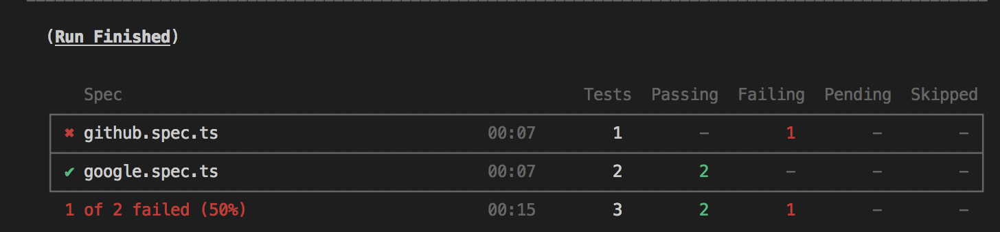
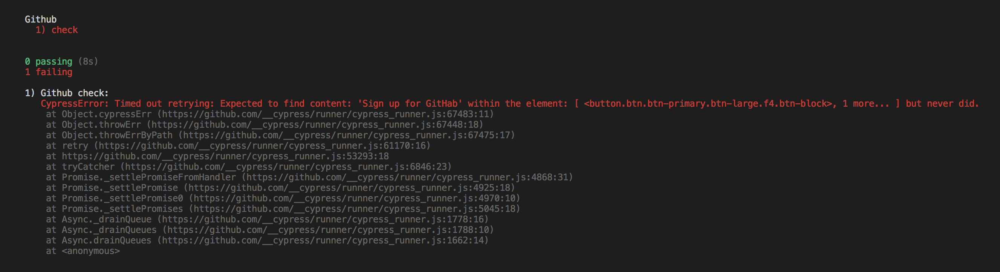
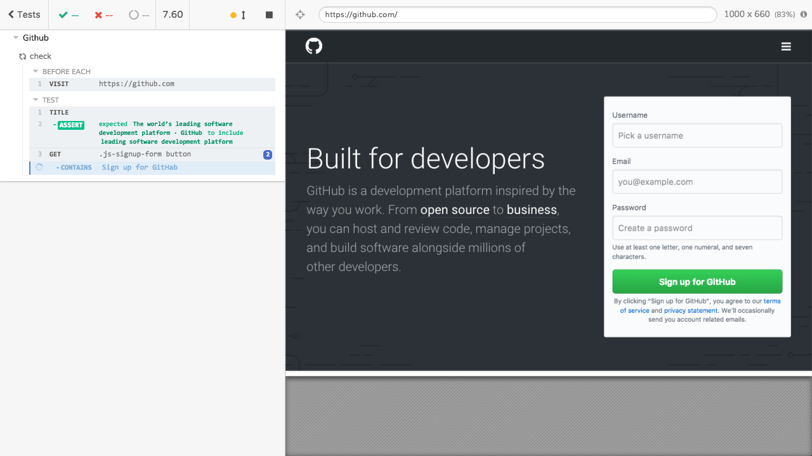
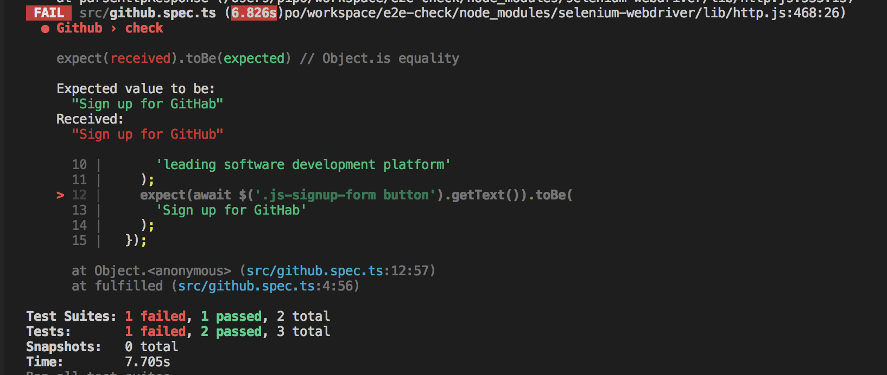
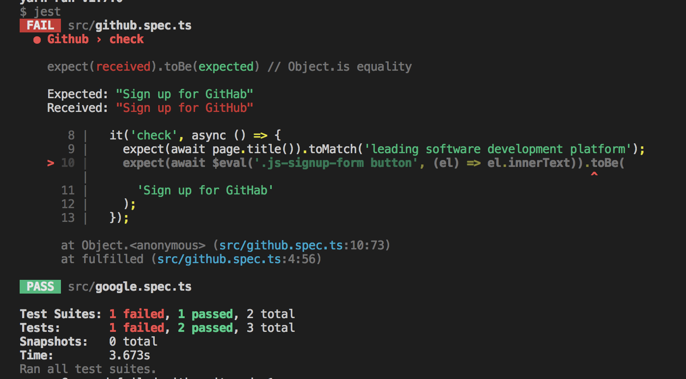
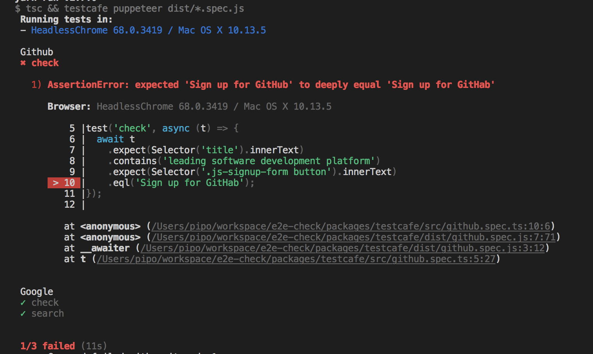
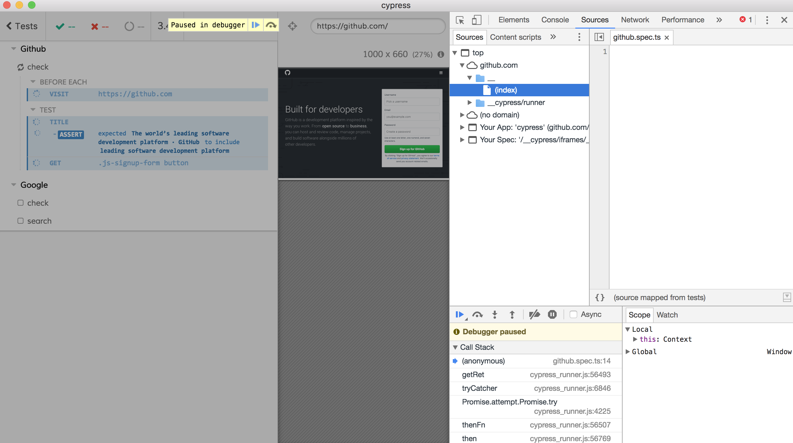
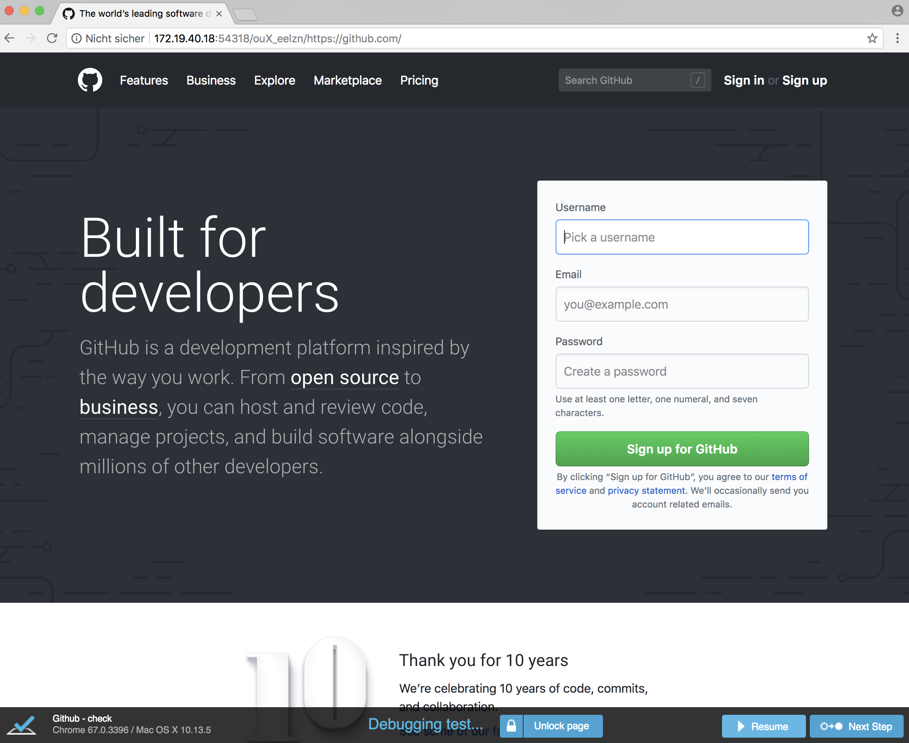

# e2e-check

> A simple overview about current E2E testing solutions for web apps.

## Introduction

For several years we used Selenium for E2E-testing our web applications. We started by using [`protractor`](https://www.protractortest.org) and then switch to using [`selenium-webdriver`](https://github.com/SeleniumHQ/selenium/tree/master/javascript/node/selenium-webdriver) directly. In the beginning we used a custom Selenium grid to test our applications on several browsers including different Internet explorer versions, Chrome, Safari and Firefox.

We hade a _lot_ of problems with this approach:
- The selenium grid itself was very flaky.
- Updating and maintaining the grid was cumbersome.
- Developers updated their browsers on developer machines more often, so we used different browser versions on CI vs. locally.
- Debugging was quite hard the way selenium handled their asynchronous APIs (e.g. bad stack traces). (This now becomes better by native `async`/`await` support.) 
- Sometimes the same API which worked in 9 cases didn't work on the 10th case. (E.g. clicking a button wasn't possible in test case 10 without a logical reason like being invisible or covered by a different element. It just didn't work.)
- Sometimes the same API worked in _nth_ browsers in _nth_ versions, but not in Firefox 33 for example for now no clear reason.
- Some Selenium versions are only compatible to browsers in version X.
- It was hard to maintain the tests.

All in all having nice and stable automatic cross browser testing was just a dream.

Some months ago we switched to only test with Selenium on [`Puppeteer`](https://github.com/GoogleChrome/puppeteer). We lost (flaky) cross browser testing, but reduced maintenance time by a magnitude and our tests became _much_ more stable - so the E2E tests became actually useful again. (Cross browser testing is nice, but it solves no problem, if it isn't reliable.) The time we saved in maintenance could be invested in manual cross browser tests when needed. (Cross browser compatibility of web technology is not perfect. There are so many browser quirks, but it became definitely better in the last years. In my experience we don't have as many browser specific bugs as we had ten years ago. At least if you mostly use battle tested frameworks, established patterns and no experimental APIs.)

We gained other benefits by this approach as well. Puppeteer automatically installs a local copy of Chrome in a specific version, so developers and CI finally use the exact same environment for tests. Puppeteer can also run headless which helps in a lot of CI systems.

Nevertheless we still had problems like the one mentioned above: You click 9 buttons and everything works fine, but the 10th button can't be clicked for unknown reasons. And sometimes you have to update Puppeteer and occasionally break a test because of this. I can't say for sure that Selenium caused these problems, but my guess is if we would write our tests directly in Puppeteer it would be more likely to eliminate this point of failure as well. 

Why did we still had Selenium tests at all and haven't used Puppeteer directly? Well, every test was already written and using _both_ helped us to migrate and play around with Puppeteer. And if we'd ever _need_ to test something in a different browser, it would be quite easy...

But now as we try to use _just_ Puppeteer and give up on _automatic_ cross browser testing, we could have a look on other projects as well, before we settle on a solution. So we planned a small discovery. Write the same tests in four E2E testing frameworks: Selenium (with Puppeteer), _pure_ Puppeteer, [`testcafe`](https://github.com/DevExpress/testcafe) and [`Cypress`](https://www.cypress.io/).

Below you'll find an outline about our project requirements and some key differences between the frameworks. You'll find the test cases in the `packages/` directory. I will not explain the frameworks in depth, I'd recommend to checkout the example yourself to see if you like the APIs of the different framerworks.

## Test scenario

Really basic and just a starting point.
- Check Githubs homepage and verify the title and sign up button.
- Check Googles homepage and verify the title and search button.
- Use Googles search form.

## Requirements

We try to
- test the same functionality in every project
- write the tests and configs in a similar structure for easier comparison
- use TypeScript, because we ️❤️ TypeScript
- showcase a debugging example
- use [`Jest`](https://facebook.github.io/jest/) if possible (because it has a nice API and we use it for unit tests as well)

## Differences

- Cypress runs inside the browser, while every other framework runs a Node process.
  - If you need non-browser information (check mails, logs, etc.) in Cypress, you essentially need to start a local Node server which can than be queried for certain informations by your Cypress tests. (E.g. your test can request `localhost:8080/did-i-got-my-email` and the local server will serve you a useful response.)
- Cypress uses a bundled Electron version to support testing the same browser in the same version on CI and locally. AFAIK it isn't the only framework where I can't use Puppeteer directly. (Just nice to know - not a real drawback.)
- Cypress seems to always offer synchronous APIs, but they actually create an internal queue of asynchronous commands. AFAIK testcafe has some internal queue as well.
- Cypress and testcafe come with their own test runners - no Jest love here 😞
- Cypress creates awesome videos with a nice GUI showing information about your tests out of the box 😍
  - If you would like to see something similar in Puppetter, maybe vote on the [corresponding feature request](https://github.com/GoogleChrome/puppeteer/issues/478). There is the [`puppeteer-recorder` lib](https://www.npmjs.com/package/puppeteer-recorder) which does something similar, but you have no start/stop API and can only say _"record for x seconds"_ which is hard to know beforehand in this case.
- Cypress also create screenshots from failing tests by default.
  - I tried to create a screenshort reporter for Jest and Puppeteer, but failed. I learned that we probably need to use plain Jasmine reporters ([as in this Selenium example](https://github.com/alexeyraspopov/jest-webdriver/tree/master/packages/jest-screenshot-reporter)), because I _think_ we can't access the Jest environment (which holds the Puppeteer instance to call `page.screenshot()`) in a normal reporter, but I got `Target closed.` errors. Probably because screenshot taking is async and the test doesn't wait for the reporter...?
- `@types/puppeteer` could need some love, but nothing a pull request couldn't fix 👌
- Puppeteers waits until functionality is very basic. `waitForFunction` is evaluated in browser context. If you need to await something on the Node side you'll need a helper lib like [`async-wait-until`](https://github.com/devlato/waitUntil).
- Testcafe seems to automatically await certain assertions and conditions.
- In some tests I needed to close the overlay of Googles search to click the search button. It looks like this overlay doesn't appear in Cypress tests and I'd guess this is _wrong_. ⚠️
- Not sure why, but out of nowhere **my Selenium tests started to fail**, because of _"Another Selenium process may already be running or your java version may be out of date."_ ️️️️⚠️ I guess this is a problem with my session creation. I wonder why it hasn't happened before. 🤔

## Performance

Just a small check. Two runs with Node v8.11.2 in headless mode. I run `$ yarn test` and look at the yarn output `✨  Done in 00.00s.`.

As far as I understand Cypress runs tests sequentially by design. I _think_ Puppeteer could run the tests in parallel with Jest, but my experiments with `browser.newPage` failed, so it runs sequentially now as well. Selenium seems to run the tests in parallel. Testcafe was configured to run in parallel (with the flag `--concurrency 2`).

- Cypress: 21.53s, 21.72s
- Puppeteer: 4.88s, 4.72s ❤️
- Selenium: 4.38s, 4.29s ❤️
- Testcafe: 8.81s, 9.18s

## Errors

For my debugging test I changed the `github.spec.ts` in every framework to check if the signup button contains `Sign up for GitHab` (misspelled GitHub). I tried to enable Source Maps in every case.

Let's start with **Cypress**. It fails with the following overview stating `github.spec.ts` failed, but not which test exactly (if we would have multiple tests here).



I actually need to scroll up a while to find my failing test. The stack trace sadly doesn't point to my actual test. Everything is hidden by some Cypress internal logic. I'm not even sure my source maps would work. There error message is okay, but not perfect. It shows me a different selector than I used and it doesn't show me the received content. 😔 This happens, because Cypress internally creates a queue of asynchronous command. Earlier versions of `selenium-webdriver` worked in a similar way and I know by experience that debugging this is usually complicated.



Note however, that Cypress automatically creates a screenshot of the failing step (which can be found inside `./packages/cypress/cypress/screenshots/`). It looks like this:



Now to **Selenium**. Jest collects errors at the bottom, so no scrolling is needed. It also shows a preview of your code, a small stack trace and the received content which is _awesome_. The source maps just work. ❤️



The same is true for **Puppeteer**, because I use Jest here as well.



**Testcafe** doesn't place the errors at the bottom of the output., In this case the output was quite small, so I didn't need to scroll, but it could grow in other cases. Besides that the output was nice: a code preview and stack trace with correct source map support and the received value was logged.



## Debugging

All debugging examples were tested by running `$ yarn test:debug` and trying to debug `github.spec.ts` again before the assertion on the signup button.

Let's start with **Cypress** again. Because it stores an internal queue of asynchronous commands, debugging works slighty different, too. You need to place the debugger statement inside a `then()` callback. After the Cypress app opend you click on _"Run all tests"_ for example and the application correctly stop with the opened debugging tools:

```ts
  it('check', () => {
    cy.title().should('include', 'leading software development platform');
    cy.get('.js-signup-form button')
      .then(() => {
        debugger;
      })
      .contains('Sign up for GitHab');
  });
```



Debugging a **Selenium** test could happen in the Node or browser context, depending on your needs. In the Node context you just place a regular `debugger;` statement and debug the test like a normal Node application (see [here for example](https://github.com/Mercateo/how-to-debug-javascript)). I don't know why, but I couldn't force Selenium to automatically open the devtools via `options.addArguments('auto-open-devtools-for-tabs')`. So currently you need to open the dev tools yourself. The debugging statement can be placed via `await driver.executeScript('debugger;');` in your browser context. Note that probably need to specify [a Jest timeout](https://facebook.github.io/jest/docs/en/troubleshooting.html#unresolved-promises) or it will automatically close the test after some time.

**Puppeteer** is quite similar to **Selenium** again, but this time I can easily open the devtools automatically in my `jest-puppeteer.config.js`. A debugger in the browser context is added via `await page.evaluate('debugger;');`. Again you'll probably need to configure the Jest timeout.

**Testcafe** behaves more like Cypress, because of the internal command queue. To debug in the browser context you'll need the `debug()` function to pause Testcafe. After that you are able to open the devtools yourself. The usage looks like this:

```ts
test('check', async (t) => {
  await t
    .expect(Selector('title').innerText)
    .contains('leading software development platform')
    .debug() // PAUSE HERE
    .expect(Selector('.js-signup-form button').innerText)
    .eql('Sign up for GitHub');
});
```



---

Thank you for reading this article. ♥

I highly appreciate pull requests for grammar and spelling fixes as I'm not a native speaker. If you find some bug or if you want to make the code simpler, feel free to make a pull request as well. Thank you!
